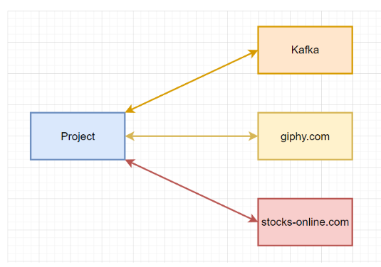
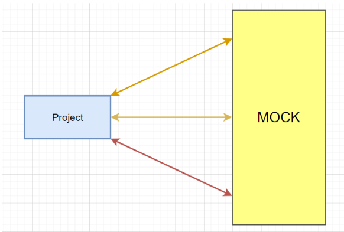

[](https://github.com/Team-project-CS/ms/actions/workflows/maven.yml)
[](https://github.com/Team-project-CS/ms/actions/workflows/docker-image.yml)
[](https://github.com/Team-project-CS/ms/actions/workflows/deploy-job.yml)

## Description

Project for mocking HTTP endpoints and Queue messages.

Consider this picture



This project can help to test communication layer between
your project and external services it uses.



## How to launch

#### Tools you need

- Docker
- Maven
- Java 17

#### Launch script

```
docker network create web
mvn clean package dockerfile:build -DskipTests=true
docker-compose up -d
```

## Documentation

After the launch you can see all the available
commands in swagger auto-generated documentation

http://localhost:8082/api-docs/swagger-ui/index.html - http endpoints mock

http://localhost:8081/queue-docs/swagger-ui/index.html - queue messages mock

http://localhost:8080/ - simple UI

### Deployed instance

We also managed to deploy the project. Here are some **probably** working links

http://24mock.ru/queue-docs/swagger-ui/index.html — q

http://24mock.ru/api-docs/swagger-ui/index.html — api

http://24mock.ru/ - UI 
